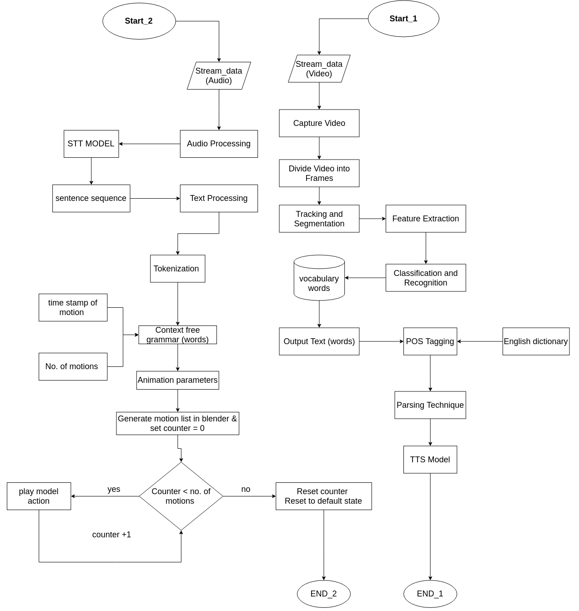

# **Sign to speech (StoS):**
Converting the American sign language into speech, and vice versa.

# **Project Description:**
StoS is a python library, created by a team from the Egyptian information technology institute (ITI) as their graduation project.

The main purpose of the library is converting the American sign language to speech, and vice versa, this is achieved by using deep learning, NLP, and computer vision. The first release of the project is limited only to the following 50 common English word:
```
[age, book, call, car, day, Egypt, English, enjoy, every, excuse, football, forget, fun, good, hate, have, hello, help, 
holiday, I, am, love, meet, month, morning, my, NA, name, nice, no, not, number, okay, picture, play, read, ride, run, 
sorry, speak, sport, take, thanks, time, today, understand, what, when, where, year, yes, you, your]
```

## **StoS is divided into two main pipelines:**
>## **1. sign to speech:**
>
In sign to speech pipeline, the primary role is converting the streamed American sign language videos into a set of sentences, or voice, using NLP pipeline, after being predicated by our DL model.

The output of that DL model is a list of words, so in order to construct a basic English sentences, these words will pass through NLP model for modification, and sentence construction and correction. As a result of the previous processes, we will have an English text, which is grammatically correct, and can be converted into audio clip up to the user preferences.  

> 
>## 2.	**speech to sign:**
>
>
This pipeline controls the translation process of the streamed speech into American sign language video. 


# Work Flow
<p align="center"></p>

# Prerequisites
- python 3.8
- OpenCV

# Installation
```bash
pip install stos
```

# How to use
#### **To Convert Sign to Speech**

```python
import os
from cv2 import cv2
from stos.sign_to_speech.sign_to_speech import SignToSpeech

sts = SignToSpeech(1, 20, os.path.join('model', 'cv_model.hdf5'), os.path.join('model', 'names'),
                   display_keypoint=True, display_window=False)
for word, frame in sts.start_pipeline():
    cv2.imshow('frame', frame)
    key = cv2.waitKey(1)
    if key == ord('q'):
        exit(0)
```

#### **To Convert Speech to Sign**

```python
from cv2 import cv2
from stos.speech_to_sign.speech_to_sign import SpeechToSign

sts = SpeechToSign(10)
for frame in sts.start_pipeline():
    cv2.imshow('frame', frame)
    key = cv2.waitKey(1)
    if key == ord('q'):
        exit(0)
```

# **Contributors:**

- Abdelaziz Gamal Mousa
- Amira Mohammed Abd Elmajeed
- Habiba Khaled Ibrahim
- Sara Hesham Hassan
- Amal Abdalah Saad
- Abdallah Gaber Ahmed Elsharawy
- Ahmed Mohamed Ibrahem Sayed
- Mohamed Hany Ahmed Abdelaty
- Mostafa Gaber Aboelghit Abdou Elraghy
- Muhammad Ayman Muhammad El-sawy
- Ahmed Tarek Mansour Al Ashry

# Licence
[MIT Licence](https://github.com/azizmousa/sign_language_translator/blob/master/LICENCE)
